# Battleship Game

## Python Portfolio Project 3

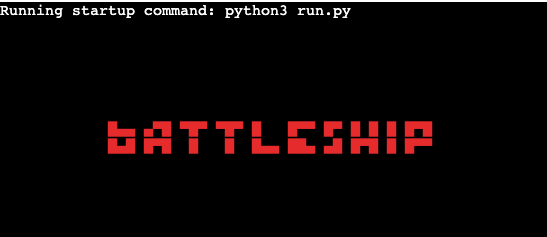

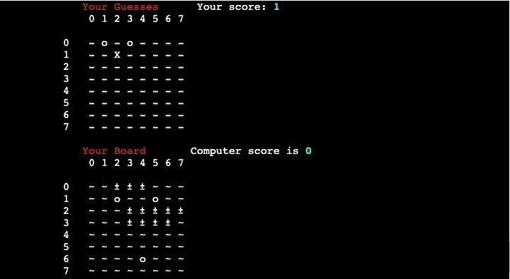

## Introduction
This battleship game was developed for Portfolio Project 3 as part of the Code Institute Diploma in 
Full-Stack Software Development. This project focuses on Python Essentials. It is designed to be played
within the Code Institute mock terminal hosted on Heroku - [Link to game](https://portfolio-project-3-battleship.herokuapp.com/)

The aim of the game is to sink all of your opponents ships before they sink yours. In this case
the user plays agains the computer. It is based on the classic battleship board game, rules for
this can be found [here](https://www.cs.nmsu.edu/~bdu/TA/487/brules.htm)

Using a command-line interface, the user can select rows and columns to guess where the computer's
ships are positioned. Each time the user makes a guess the board is updated and the user is informed
of whether they scored a hit or a miss. This continues until either the user or the computer sinks
all of their opponent's ships and win the game.

## User Experience & Game Goals
- The aim as a developer was:
  - To build an easy to play game that was enjoyable
  - To allow the user to select their own difficulty

- As a user I want to:
  - Understand the rules of the game
  - Consistent feedback on input and right/wrong guesses
  - Enjoy the game
  - Increase or decrease the difficulty if I want to play again

## Design

### Game Logic
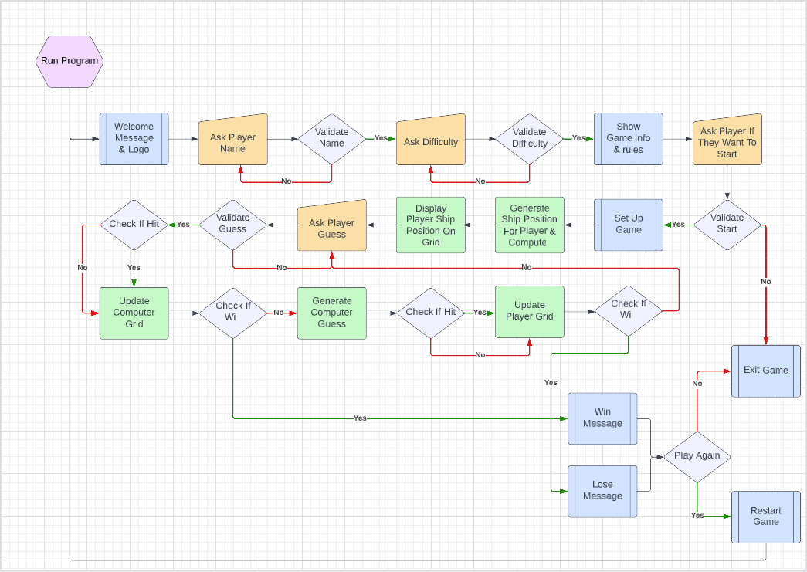

The first step in the design of this game was to create a flowchart in [Lucidchart.com](https://www.lucidchart.com/pages/)
to plan the structure and logic of the game. As can be seen in the chart the game runs through 
initial stages of verifying user name, difficulty and start choice before looping on the guess
stage until a win is detected.

### Data Model
This game relies on a number of classes to run but the model is centred on the generation, population
and testing of 3 boards:

- Board 1 stores the position of the computer's ships and is not displayed
- Board 2 stores the position of the player's ships and is displayed
- Board 3 stores the player's guesses and is displayed

The 3 boards consist of a series of lists that can be navigated using indexing as x,y co-ordinates. The
boards are populated using the methods in the Ship class and guesses are checked and marked on the board
using the methods in the Admin class. The Admin class also contains a print_game_state method to print out
the current state of the boards and scores.

Once player or computer reach the target score (amount of places taken up on board by ships) a win is declared
and player is asked if they want to play again. The classes are detailed further below.

### Code Structure

4 classes were created; board, ship, validation & admin. These were used to handle specific areas of the game:
- Board
  - Creates a board in the style of a grid which can be altered as ships added & guesses made
  - Contains methods to print out the board and to clear the board if needed
- Ship
  - Creates locations for 1-3 ships depending on game difficulty
  - Contains methods to test for free locations, position ships and mark them on the board
- Validation
  - Contains methods to test if input is valid and raise a ValueError if it is not
- Admin
  - Creates an instance of the game containing the conditions and elements needed to play
  - Contains methods to complete running of game:
    - Verifies correct amount of spaces taken up by ships
    - Sets game conditions based on difficulty choice
    - Takes user guess and generates computer guess
    - Checks guesses to see if they are a hit or miss and marks board appropriately
    - Displays current game status; boards, scores etc.
    - Checks if either player has won
    - Using time library, simulates loading to improve rhythm of game

### Aesthetic Design
The approach to the look of the game was to keep it minimal and simple, using pops 
of color to highlight specific points. The thinking behind this was to keep the grid
and co-ordinates clear by not trying to over complicate its design. The color was
added using the [rich](https://github.com/Textualize/rich) library and the title design
was created using an [ASCII text generator](https://fsymbols.com/generators/smallcaps/).

## Features
### Validation
All of the user input is tested using the Validation class for suitability, see below images
for examples of invalid input

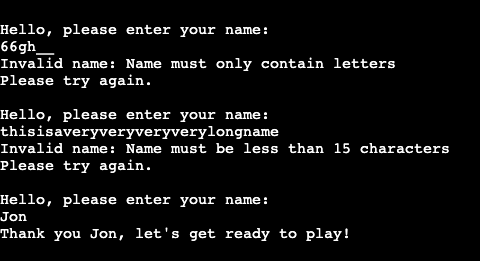

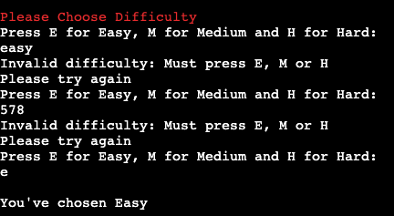

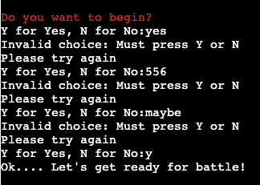

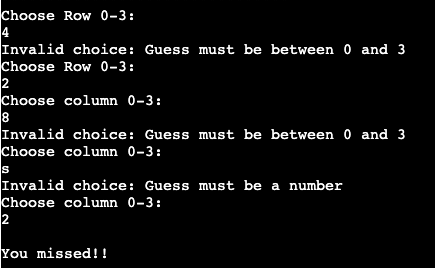

### Boards
The boards are populated with ships and then printed. Once a guess is generated, the board is 
checked at these co-ordinates and then marked 'X' if a hit or 'o' is a miss.

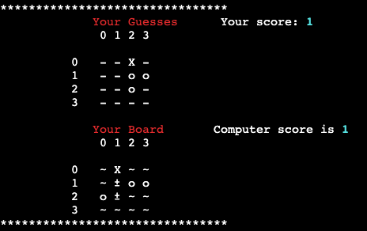

### Scores
Each player's score is incremented every time they hit a ship. Once they reach the target score 
they win the game.

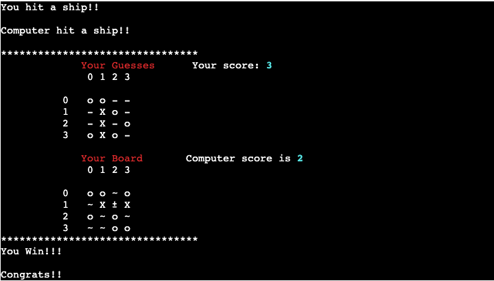

## Technologies Used
- Languages:
  - [Python](https://www.python.org/)

- Packages:
  - [Random](https://docs.python.org/3/library/random.html?highlight=random#module-random): Used to generate ship positions
  - [Time](https://docs.python.org/3/library/time.html?highlight=time#module-time): Used to display content gradually by using sleep() function
  - [Rich](https://github.com/Textualize/rich): Used to add colour to highlight text
  - [Flake8](https://flake8.pycqa.org/en/latest/): Used as style guide enforcement. Built into Gitpod workspace
  - [Pylint](https://pypi.org/project/pylint/): Used as static code checker. Built into Gitpod workspace

- Websites/Programs/Frameworks:
  - [Gitpod](https://www.gitpod.io/): Used for version control and to develop/commit changes to project
  - [Github](https://github.com/): Used to store the project's code after push from Gitpod
  - [VSCode](https://code.visualstudio.com/): Used to experiment with classes and develop functions before adding to Gitpod
  - [Heroku](https://dashboard.heroku.com): Used for deployment of game
  - [Lucidchart.com](https://www.lucidchart.com/pages/): Used to build game flowchart
  - [ASCII text generator](https://fsymbols.com/generators/smallcaps/): Used to generate game startup logo
  - [Conventional Commits](https://www.conventionalcommits.org/en/v1.0.0/#specification): Adhered to conventional commit guidelines for standardised commit messages

## Testing

### Functionality Testing

- Functionality testing was carried out on each feature laid out in logic chart of game, details in following table:

| Proposed Feature                                                                               | Functioning            |
| :--------------------------------------------------------------------------------------------- | :--------------------: |
| Welcome Message and logo                                                                       |          Yes           |
| Ask player name                                                                                |          Yes           |
| Name validation; no numbers, empty string or string > 15 characters                            |          Yes           |
| Ask player for difficulty choice                                                               |          Yes           |
| Difficulty validation; must be 'E', 'M' or 'H'                                                 |          Yes           |
| Display game rules                                                                             |          Yes           |
| Ask player if they want to start                                                               |          Yes           |
| Start validation; must be 'Y' or 'N'                                                           |          Yes           |
| Set up game; conditions set, boards created, scores set                                        |          Yes           |
| Generate ship positions for player and computer and populate boards                            |          Yes           |
| Print out board with player's ships and their guess board                                      |          Yes           |
| Ask for player row/column guess                                                                |          Yes           |
| Validate guess; must be an integer between 0 and board size - 1 (for indexing)                 |          Yes           |
| Generate computer's guess                                                                      |          Yes           |
| Check guesses for duplication and if it is a hit. Repeat until hit or miss                     |          Yes           |
| Update boards to reflect guesses                                                               |          Yes           |
| Check if either player has reached the target score to win                                     |          Yes           |
| Display win/lose message depending on result                                                   |          Yes           |
| Ask player if they want to play again, game restarts                                           |          Yes           |

### Input Validation
Input validation is carried out using the Validation class at every point where the user is asked to 
input data. If the input is not valid a ValueError is raised and input is asked for again. This prevents
the game crashing due to incorrect input. Inputs that are validated are explained further in [Features](#features) section.

### Validator Testing
Pylint and Flake8 were useful in the development of this game as they continuously tested for errors in styling, indentation
and syntax within the GitPod workspace. These errors that occured were fixed as soon as possible, evidence of these being
adressed can be seen in [commits](https://github.com/eosull/Portfolio-Project-3/commits/main) that use the 'fix' and 'refactor' type.

All code was also passed through the [CI Python Linter](https://pep8ci.herokuapp.com/) with no errors found.

### Issues Faced During Development
- Some examples of issues faced in development:
  - Rich library was not added automatically to requirements.txt file using pip freeze terminal command. This caused
  the module not to be found on Heroku when deployed. This was resolved by adding the rich dependancy into the
  requirements file manually.
  - The size of the terminal window deployed on Heroku was something that had to be considered when designing the final
  output of the game. In order to fit the two boards into the window whitespace and unnecessary text had to be removed 
  so the user can see both boards, scores and input guess without having to navigate up.
  - Name input validation could be passed by just pressing 'Enter' key and not submitting data. Fixed this by adding validation
  check to make sure at least 1 character was inputted.

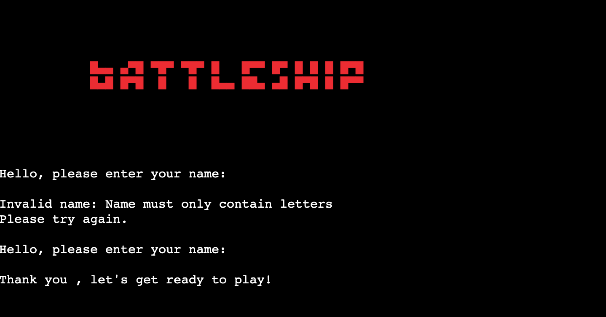

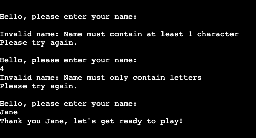

## Deployment
The game was deployed to [Heroku](https://dashboard.heroku.com) by following these steps:
- Login or create account with Heroku
- Select 'Create new app' from the home page
- Enter unique app name, select region and click 'create app'
- Navigate to app settings tab
- In 'Config Vars' section enter 'port' into key box, '8000' into value box and hit add
- In 'Buildpack' section add 2 buildpacks; Python and node.js (in that order) and click save
- Navigate to app deploy tab
- Select GitHub as deployment method and confirm connection to GitHub
- Search for repository and click connect
- Select deployment type; automatic or manual deploys. Automatic has been chosen in this case so changes are pushed to GitHub the app updates automatically

## Forking/Cloning Project
- Project can be forked by following these steps:
  - On [GitHub project page](https://github.com/eosull/Portfolio-Project-3) find the fork button at top right of the page
  - Click this button and select owner for forked repository
  - Change title of forked repository and add description if desired
  - Choose to copy the default brach (in this case 'main')
  - Click 'Create Fork' and create your fork
  - [More info on process](https://docs.github.com/en/get-started/quickstart/fork-a-repo)

- Project can be cloned by following these steps:
  - On [GitHub project page](https://github.com/eosull/Portfolio-Project-3) click the 'Code' dropdown
  - Copy either HTTPS, SSH or GitHub CLI URL
  - Open terminal, enter 'git clone' and paste in the repository URL
  - Hit enter to create your project clone
  - [More info on process](https://docs.github.com/en/repositories/creating-and-managing-repositories/cloning-a-repository)

## Credits
### Content
- The idea for this game came from the Code Institute suggested project ideas
- The project was created from and made deployable by using [Code Institute Python Essentials Template](https://github.com/Code-Institute-Org/python-essentials-template)
- The battleship logo design was created using [Fsymbols small caps generator](https://fsymbols.com/generators/smallcaps/)

### Resources
- [Stack Overflow](https://stackoverflow.com/)
- [Python reference](https://docs.python.org/3/reference/)
- [W3Schools Python](https://www.w3schools.com/python/default.asp)
- [Rich Library Docs](https://rich.readthedocs.io/en/stable/introduction.html)
- [Python OOP YT tutorial](https://youtu.be/ZDa-Z5JzLYM)
- [Battleship rules](https://www.cs.nmsu.edu/~bdu/TA/487/brules.htm)
